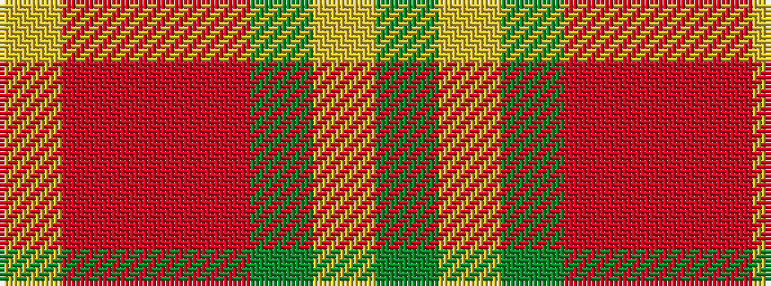

GYGRRRY

It is a 7 stripe tartan.

<figure class="pat-woven">

<figcaption>idealised sample</figcaption>
</figure>

## Colour Sequence



## Tartans with this colour sequence

| Tartans |
|---------------|
| [Unidentified, Silk Plaid](/variants/s7/y7ly12g30oi12o14r11ly2~x2/)|
||
