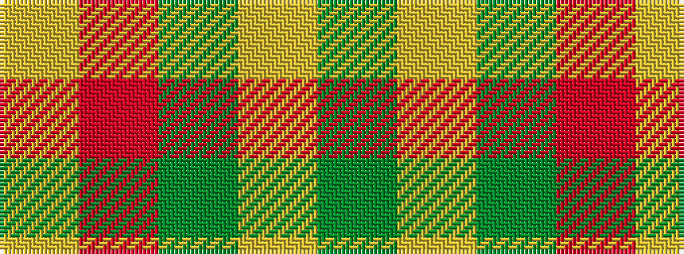

GYGRY

It is a 5 stripe tartan.

<figure class="pat-woven">

<figcaption>idealised sample</figcaption>
</figure>

## Colour Sequence



## Tartans with this colour sequence

| Tartans |
|---------------|
| [Pendlebury, Andrew (Personal)](/setts/s5/g25lo6dg5r3lo10~x4/)|
||
