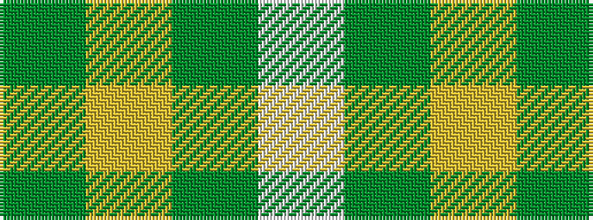

GYGW

It is a 4 stripe tartan.

<figure class="pat-woven">

<figcaption>idealised sample</figcaption>
</figure>

## Colour Sequence



## Tartans with this colour sequence

| Tartans |
|---------------|
| [O'Neill](/setts/s4/g9lo20g40w5~x2/)|
||
| [O'Neill Irish Family Tartan Tartan Number: 2464. Earliest known date: 1985 O'Neill is an Irish family tartan. The dark yellow stripe is mustard or dark saffron. See products available Copyright © Blair Urquhart, Comrie, 2015](/setts/s4/g9ly20g40w5~x2/)|
||
| [Young in Australia](/setts/s4/w81dg6lo8dg8~x2/)|
||
