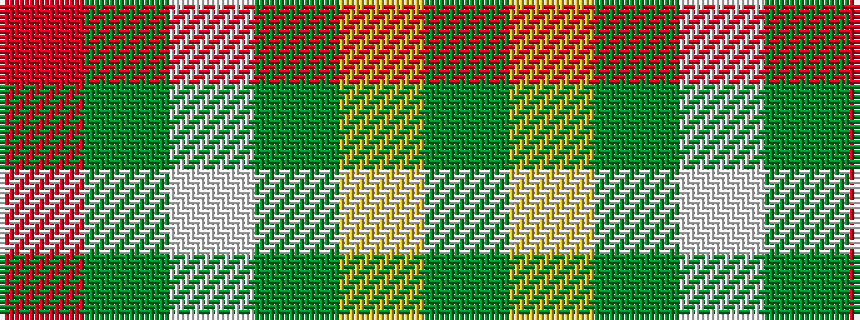

GYGWGR

It is a 6 stripe tartan.

<figure class="pat-woven">

<figcaption>idealised sample</figcaption>
</figure>

## Colour Sequence



## Tartans with this colour sequence

| Tartans |
|---------------|
| [City of Vancouver (Commemorative)](/variants/s6/gi2lo1gi12lb6g12r1~x4/)|
||
