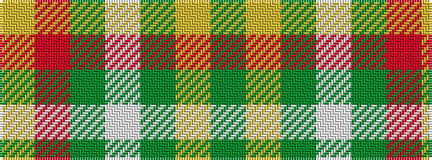

GYGWGRY

It is a 7 stripe tartan.

<figure class="pat-woven">

<figcaption>idealised sample</figcaption>
</figure>

## Colour Sequence



## Tartans with this colour sequence

| Tartans |
|---------------|
| [Maver (Buckie)](/variants/s7/g1ly1g1w1g10r20ly1~x4/)|
||
