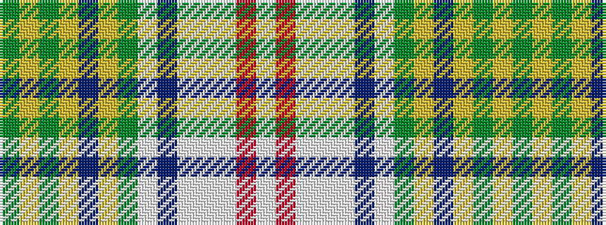

GYGYBYGWBWWWRW

It is a 14 stripe tartan.

<figure class="pat-woven">

<figcaption>idealised sample</figcaption>
</figure>

## Colour Sequence



## Tartans with this colour sequence

| Tartans |
|---------------|
| [Werris Creek Catholic Parish (Corp.)](/variants/s14/gi4lr1gi5ly4p3ly5g6w3b5w2lb3w4r3w1~x2/)|
||
