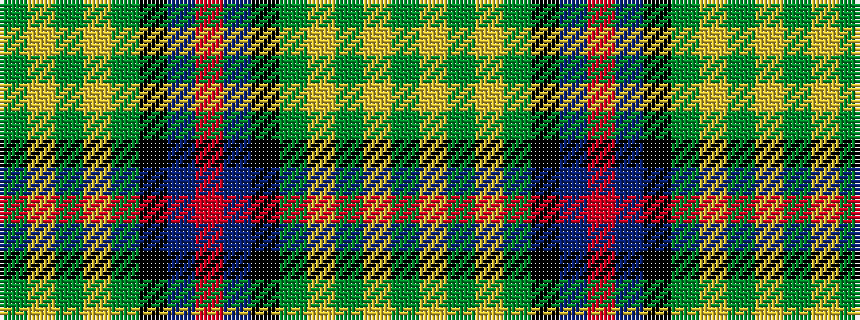

GYGYGKBRBKGYGYG

It is a 15 stripe tartan.

<figure class="pat-woven">

<figcaption>idealised sample</figcaption>
</figure>

## Colour Sequence



## Tartans with this colour sequence

| Tartans |
|---------------|
| [Unidentified (Teddy Bear)](/setts/s15/dg30ly2dg5ly2dg4k15db29r2db29k15dg5ly2dg4ly2dg17~x2/)|
||
| [Unidentified, B'gowrie](/setts/s15/g30ly2g5ly2g4k15db29r2db29k15g5ly2g4ly2g17~x2/)|
||
