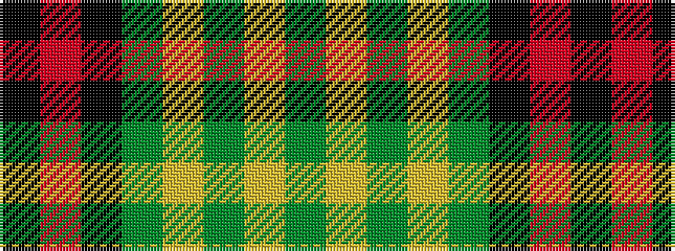

GYGYGKRK

It is a 8 stripe tartan.

<figure class="pat-woven">

<figcaption>idealised sample</figcaption>
</figure>

## Colour Sequence



## Tartans with this colour sequence

| Tartans |
|---------------|
| [Brunton (Personal)](/setts/s8/k7r3k27dg27ly3dg3ly3dg3~x2/)|
||
| [Brunton (Personal)](/setts/s8/k7r3k27g27ly3g3ly3g3~x2/)|
||
