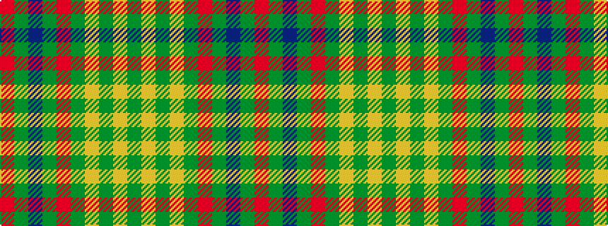

GYGYGRGBGR

It is a 10 stripe tartan.

<figure class="pat-woven">

<figcaption>idealised sample</figcaption>
</figure>

## Colour Sequence



## Tartans with this colour sequence

| Tartans |
|---------------|
| [Hutcheson](/variants/s10/r30y4dt8y4r30g30lo3g4lo3g30~x2/)|
||
