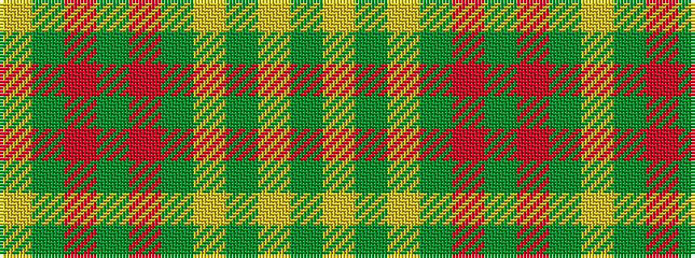

GYGYGRGRGY

It is a 10 stripe tartan.

<figure class="pat-woven">

<figcaption>idealised sample</figcaption>
</figure>

## Colour Sequence



## Tartans with this colour sequence

| Tartans |
|---------------|
| [Montreal](/variants/s10/lo78g10r2g1r2g6lo2g3lo2g43~x2/)|
||
