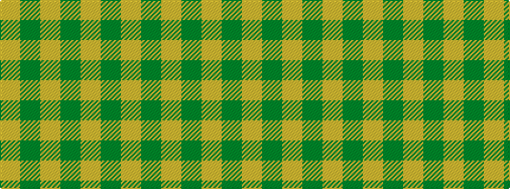

GYGYGY

It is a 6 stripe tartan.

<figure class="pat-woven">

<figcaption>idealised sample</figcaption>
</figure>

## Colour Sequence



## Tartans with this colour sequence

| Tartans |
|---------------|
| [Barbie's Moss Plaid (Yellow & Green)](/variants/s6/y3lo3y20lo20y20lo3~x2/)|
||
