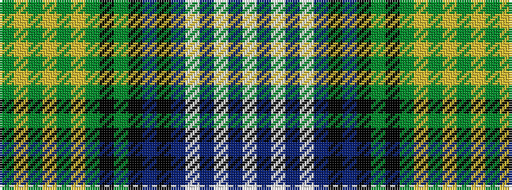

GYGYGYGKGKBKBWBWBW

It is a 18 stripe tartan.

<figure class="pat-woven">

<figcaption>idealised sample</figcaption>
</figure>

## Colour Sequence



## Tartans with this colour sequence

| Tartans |
|---------------|
| [Scottish Islamic](/setts/s18/dg2ly2dg2ly2dg2ly2dg18k1dg2k5db2k1db19w2db2w2db2w2~x2/)|
||
| [Scottish Islamic (Corporate)](/setts/s18/g2lo2g2lo2g2lo2g18k1g2k5db2k1db19w2db2w2db2w2~x2/)|
||
