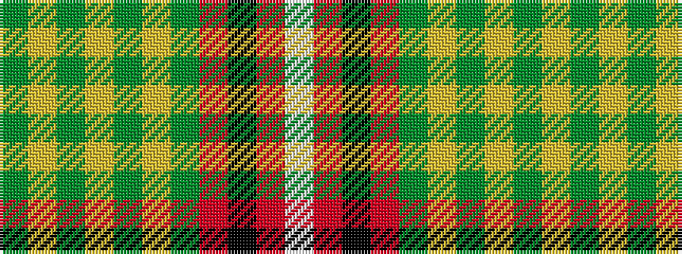

GYGYGYGRKRW

It is a 11 stripe tartan.

<figure class="pat-woven">

<figcaption>idealised sample</figcaption>
</figure>

## Colour Sequence



## Tartans with this colour sequence

| Tartans |
|---------------|
| [Drovers' Tryst (Corporate)](/variants/s11/y80lg1y2lo8y2lg1y2r15k1r3lb2~x2/)|
||
