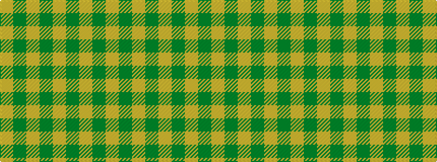

GYGYGYGY

It is a 8 stripe tartan.

<figure class="pat-woven">

<figcaption>idealised sample</figcaption>
</figure>

## Colour Sequence



## Tartans with this colour sequence

| Tartans |
|---------------|
| [Yellow Pencil](/variants/s8/dy48ly9dy6ly9dy12ly4dy2ly16~x2/)|
||
| [Yellow Pencil (Corporate)](/variants/s8/dy48lo9dy6lo9dy12lo4dy2lo16~x2/)|
||
