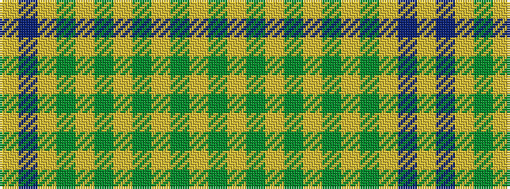

GYGYGYGYGYBY

It is a 12 stripe tartan.

<figure class="pat-woven">

<figcaption>idealised sample</figcaption>
</figure>

## Colour Sequence



## Tartans with this colour sequence

| Tartans |
|---------------|
| [Houston #2 (Personal)](/setts/s12/lo32do2lo12dy2lo1g2lo1dy2lo1g2lo1dy2~x2/)|
||
