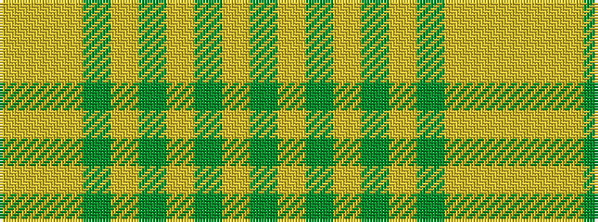

GYGYGYGYYY

It is a 10 stripe tartan.

<figure class="pat-woven">

<figcaption>idealised sample</figcaption>
</figure>

## Colour Sequence



## Tartans with this colour sequence

| Tartans |
|---------------|
| [Twisted Kilt Society](/setts/s10/dg7lr3dg1lr2dg1lr3dg6lr1lo1lr2~x8/)|
||
