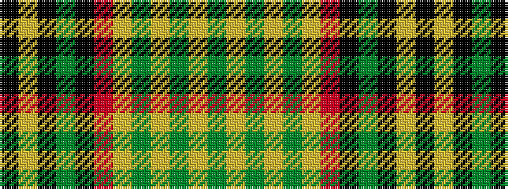

GYGYGYRKGKYK

It is a 12 stripe tartan.

<figure class="pat-woven">

<figcaption>idealised sample</figcaption>
</figure>

## Colour Sequence



## Tartans with this colour sequence

| Tartans |
|---------------|
| [Murison, Ina](/variants/s12/k4ly11k4g3k4r6ly3g3ly4g1ly30g3~x2/)|
||
