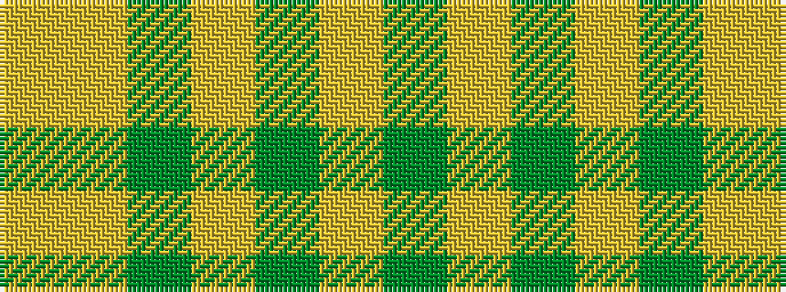

GYGYGYY

It is a 7 stripe tartan.

<figure class="pat-woven">

<figcaption>idealised sample</figcaption>
</figure>

## Colour Sequence



## Tartans with this colour sequence

| Tartans |
|---------------|
| [Lister (Misty Mountain)](/variants/s7/dy8lr29dy8lo3dy8lr8lo3~x2/)|
||
