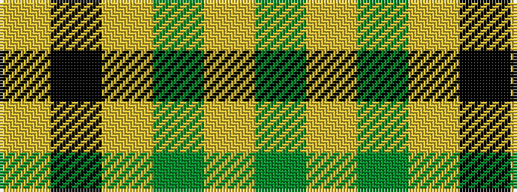

GYGYKY

It is a 6 stripe tartan.

<figure class="pat-woven">

<figcaption>idealised sample</figcaption>
</figure>

## Colour Sequence



## Tartans with this colour sequence

| Tartans |
|---------------|
| [Big Spruce Brewing](/setts/s6/dg11lo1dg1lo6k1lo1~x4/)|
||
| [Big Spruce Brewing](/setts/s6/dg11ly1dg1ly6k1ly1~x8/)|
||
