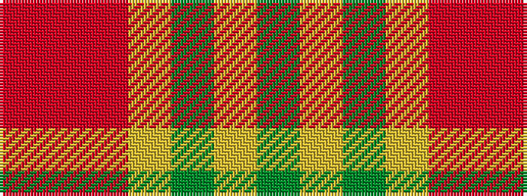

GYGYRRR

It is a 7 stripe tartan.

<figure class="pat-woven">

<figcaption>idealised sample</figcaption>
</figure>

## Colour Sequence



## Tartans with this colour sequence

| Tartans |
|---------------|
| [Fernandes (Personal)](/setts/s7/g5ly5g5ly35ri44r3ri3~x2/)|
||
