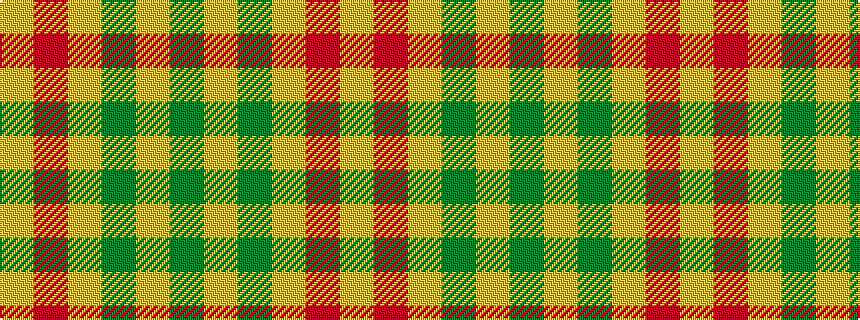

GYGYRY

It is a 6 stripe tartan.

<figure class="pat-woven">

<figcaption>idealised sample</figcaption>
</figure>

## Colour Sequence



## Tartans with this colour sequence

| Tartans |
|---------------|
| [Forget Family (Personal)](/variants/s6/g8lo1g8lo12r1lo1~x4/)|
||
| [Forget Family (Yonne)](/variants/s6/dg8lo1dg8lo12r1lo1~x4/)|
||
