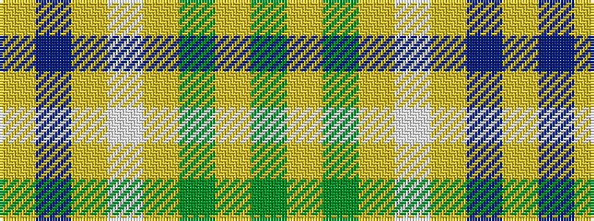

GYGYWYBY

It is a 8 stripe tartan.

<figure class="pat-woven">

<figcaption>idealised sample</figcaption>
</figure>

## Colour Sequence



## Tartans with this colour sequence

| Tartans |
|---------------|
| [Cladish](/setts/s8/y10lo5y54lo2lb32lo54b4lo10/)|
||
