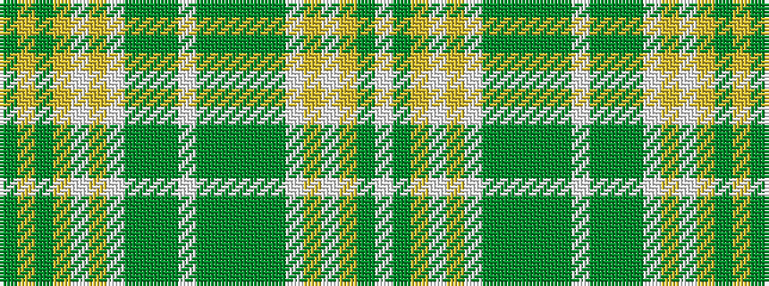

GYGYWYWGGGWGGGGGWYWYGW

It is a 22 stripe tartan.

<figure class="pat-woven">

<figcaption>idealised sample</figcaption>
</figure>

## Colour Sequence



## Tartans with this colour sequence

| Tartans |
|---------------|
| [Cox](/setts/s22/lb3dg12lo3lp3lo3lp4dg12y3dg3y3dg28w3dg3y3dg12lp4lo3lp3lo3dg12lo4dg2~x2/)|
||
