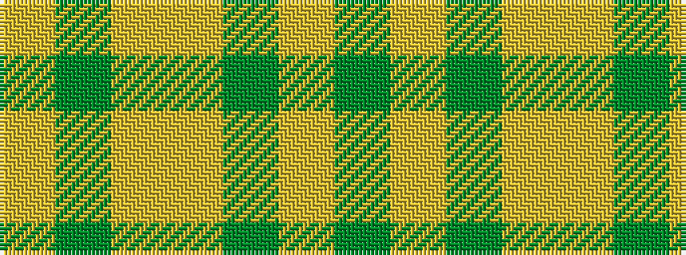

GYGYYGY

It is a 7 stripe tartan.

<figure class="pat-woven">

<figcaption>idealised sample</figcaption>
</figure>

## Colour Sequence



## Tartans with this colour sequence

| Tartans |
|---------------|
| [Prince David #1 (Royal)](/setts/s7/dy3lo2dy18lo21lo2dy3lo2~x2/)|
||
