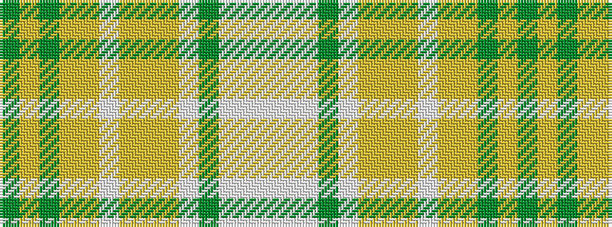

GYGYYWYYYWGWWW

It is a 14 stripe tartan.

<figure class="pat-woven">

<figcaption>idealised sample</figcaption>
</figure>

## Colour Sequence



## Tartans with this colour sequence

| Tartans |
|---------------|
| [Sakura (Japanese Four Seasons)](/variants/s14/lp6w2lp25dy2w9lgi2lg4lgi2w9lgi2lg15dy2lg2dy4~x2/)|
||
