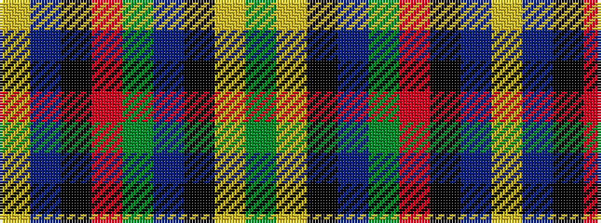

GYKBGRKBY

It is a 9 stripe tartan.

<figure class="pat-woven">

<figcaption>idealised sample</figcaption>
</figure>

## Colour Sequence



## Tartans with this colour sequence

| Tartans |
|---------------|
| [Inches of Perth (District or Clan)](/setts/s9/dy44ly2k4dp2dy15m6k3t3ly2~x2/)|
||
