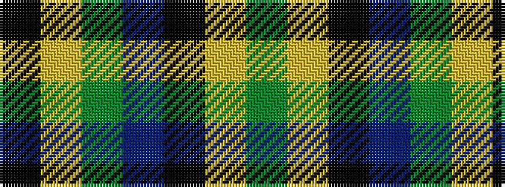

GYKBGYK

It is a 7 stripe tartan.

<figure class="pat-woven">

<figcaption>idealised sample</figcaption>
</figure>

## Colour Sequence



## Tartans with this colour sequence

| Tartans |
|---------------|
| [Verble (Personal)](/variants/s7/g4ly1k1t4g1ly1k1~x12/)|
||
