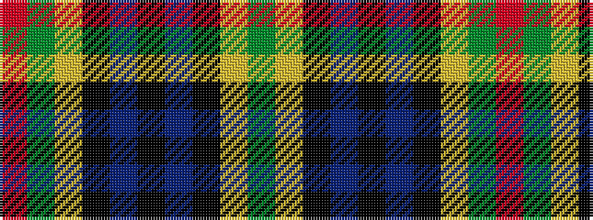

GYKBKBKYGR

It is a 10 stripe tartan.

<figure class="pat-woven">

<figcaption>idealised sample</figcaption>
</figure>

## Colour Sequence



## Tartans with this colour sequence

| Tartans |
|---------------|
| [Norwich No.079](/setts/s10/g18ly2k14t5k4t5k14ly2g18r5~x2/)|
||
