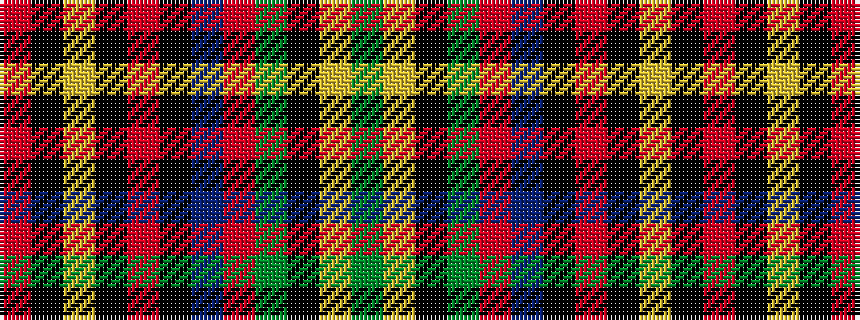

GYKGRBKRKYKR

It is a 12 stripe tartan.

<figure class="pat-woven">

<figcaption>idealised sample</figcaption>
</figure>

## Colour Sequence



## Tartans with this colour sequence

| Tartans |
|---------------|
| [Mandela Commemorative](/setts/s12/g8ly2k6g11r2dt12k12r2k6ly2k4r3~x2/)|
||
