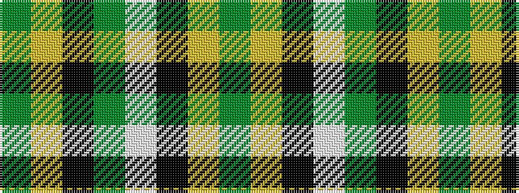

GYKGWKYG

It is a 8 stripe tartan.

<figure class="pat-woven">

<figcaption>idealised sample</figcaption>
</figure>

## Colour Sequence



## Tartans with this colour sequence

| Tartans |
|---------------|
| [Birmingham Irish Pipes & Drums](/setts/s8/dg48lo3k6w4dg3k15lo3dg4~x2/)|
||
