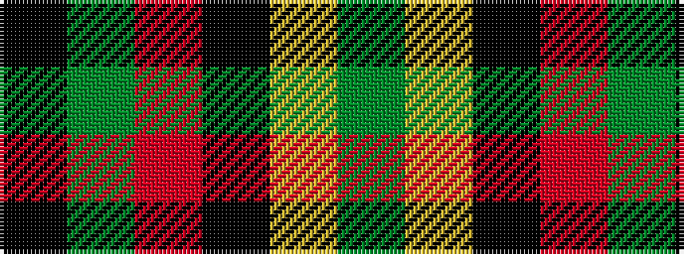

GYKRGK

It is a 6 stripe tartan.

<figure class="pat-woven">

<figcaption>idealised sample</figcaption>
</figure>

## Colour Sequence



## Tartans with this colour sequence

| Tartans |
|---------------|
| [Un-named (D C Dalgliesh) #3](/setts/s6/k3g25o3k15lr24g3~x2/)|
||
