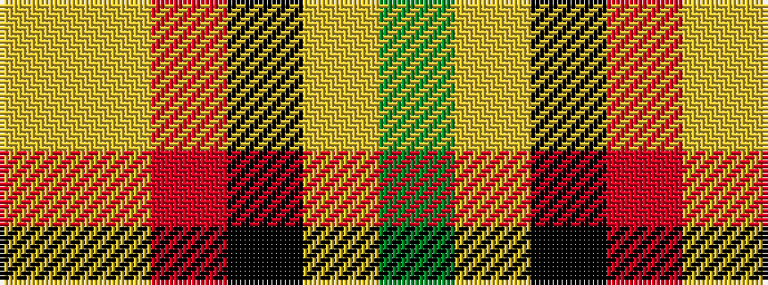

GYKRYY

It is a 6 stripe tartan.

<figure class="pat-woven">

<figcaption>idealised sample</figcaption>
</figure>

## Colour Sequence



## Tartans with this colour sequence

| Tartans |
|---------------|
| [Mitchell, Martin (Personal)](/setts/s6/lr12lo8r5k6lr7g5~x4/)|
||
