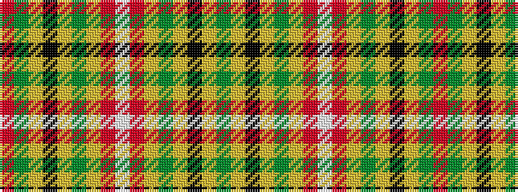

GYKYGYRWRYGYKYGR

It is a 16 stripe tartan.

<figure class="pat-woven">

<figcaption>idealised sample</figcaption>
</figure>

## Colour Sequence



## Tartans with this colour sequence

| Tartans |
|---------------|
| [Unnamed C18th - Prince Charles Edward #4](/setts/s16/r12g3ly4k2ly4g12ly2r3w1~x4/)|
||
