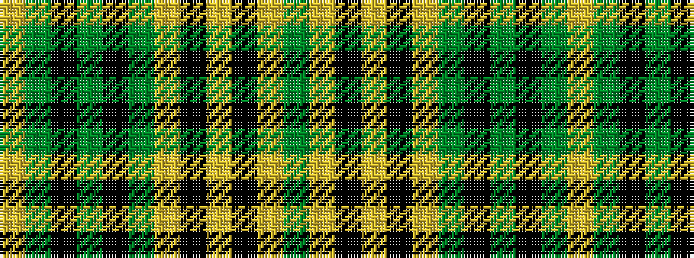

GYKYKYGKGKGY

It is a 12 stripe tartan.

<figure class="pat-woven">

<figcaption>idealised sample</figcaption>
</figure>

## Colour Sequence



## Tartans with this colour sequence

| Tartans |
|---------------|
| [Meredith of Wales](/variants/s12/g4ly20k3ly2k3ly20g24k3g2k3g24ly4/)|
||
