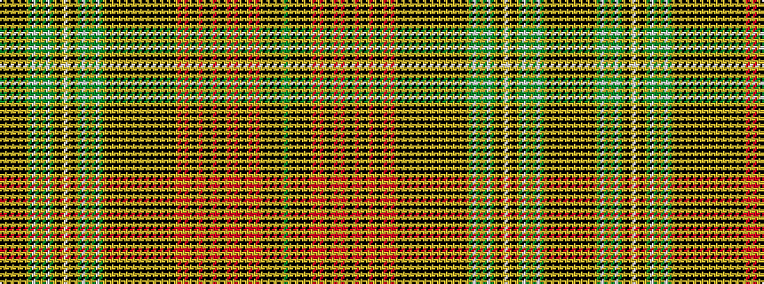

GYKYKYKYRYRYKYRYRYKYRYKYRYKYRYRYKYKYKYKYKYKYKYKYKYKYGWGYGWGYKYWYKYGWGYGWGYKYKYKYK

It is a 81 stripe tartan.

<figure class="pat-woven">

<figcaption>idealised sample</figcaption>
</figure>

## Colour Sequence



## Tartans with this colour sequence

| Tartans |
|---------------|
| [Murray, Mungo](/setts/s81/dy10ly4k2ly2k2ly2k2ly4r1ly2r1ly4k4ly3r7ly3r7ly1k1ly1r7ly1k1ly1r7ly1k1ly1r7ly3r7ly3k4ly4k2ly2k2ly4k4ly6k2ly6k2ly6k2ly6k2ly6k2ly6k10ly4dy1w2dy1ly2dy1w2dy1ly4k6ly1w2ly1k6ly4dy1w2dy1ly2dy1w2dy1ly4k10ly6k2-h6849665d9615083a/)|
||
