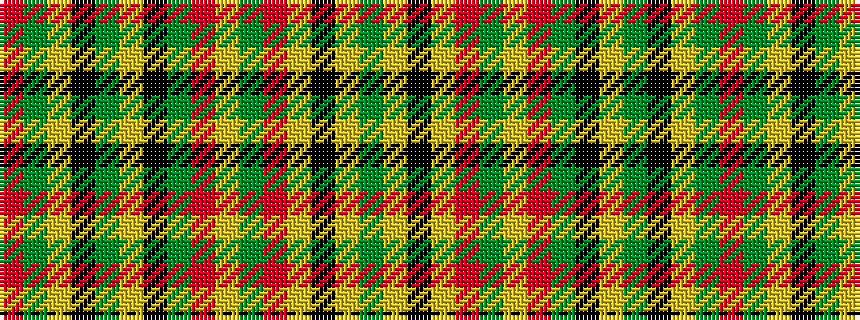

GYKYRGYRGKYGKYGR

It is a 16 stripe tartan.

<figure class="pat-woven">

<figcaption>idealised sample</figcaption>
</figure>

## Colour Sequence



## Tartans with this colour sequence

| Tartans |
|---------------|
| [Alexander Brothers - 1993 (Corp.)](/setts/s16/r15y20lr6k4y10lr22k28y6r6lr22y6r2lr12k2lr3y10~x2/)|
||
