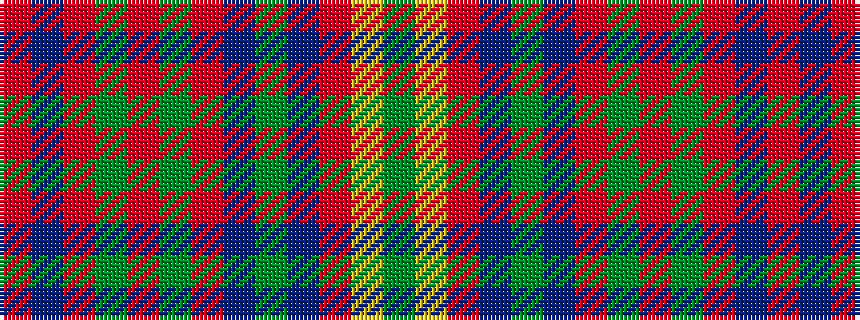

GYRBGBRGRGRBR

It is a 13 stripe tartan.

<figure class="pat-woven">

<figcaption>idealised sample</figcaption>
</figure>

## Colour Sequence



## Tartans with this colour sequence

| Tartans |
|---------------|
| [Sarna](/variants/s13/g8ly2o4p4g3p4o42g4r3g4o4p5r3/)|
||
