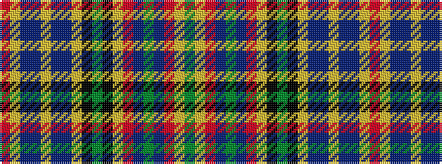

GYRBGBRYKGKYBBYBBYR

It is a 19 stripe tartan.

<figure class="pat-woven">

<figcaption>idealised sample</figcaption>
</figure>

## Colour Sequence



## Tartans with this colour sequence

| Tartans |
|---------------|
| [MacBean](/setts/r24lr1db2b1lr1b1db2lr1k1dg6k1lr1r2dr2dg1dr2r2lr1dg3/)|
||
