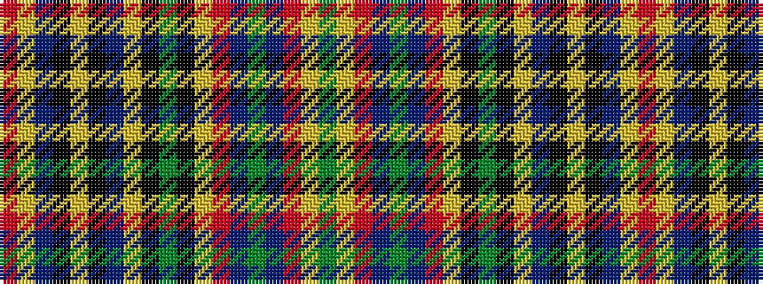

GYRBGBRYKGKYBKYKBYR

It is a 19 stripe tartan.

<figure class="pat-woven">

<figcaption>idealised sample</figcaption>
</figure>

## Colour Sequence



## Tartans with this colour sequence

| Tartans |
|---------------|
| [MacBain](/setts/r60lr2b5k2lr2k2b5lr2k2dg12k2lr2r5dr5dg2dr5r5lr2dg10/)|
||
