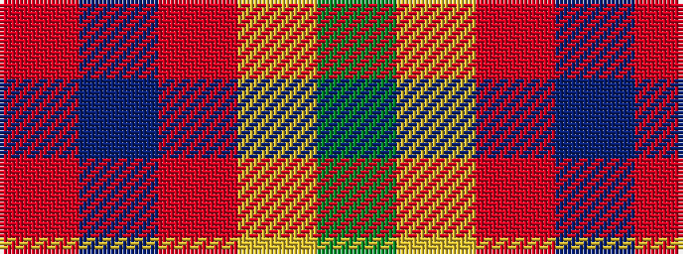

GYRBR

It is a 5 stripe tartan.

<figure class="pat-woven">

<figcaption>idealised sample</figcaption>
</figure>

## Colour Sequence



## Tartans with this colour sequence

| Tartans |
|---------------|
| [Isle of Raasay](/setts/s5/dg60ly16m8t2o3~x2/)|
||
| [Wilson's, No 179](/setts/s5/g6ly1r1t2r2~x4/)|
||
