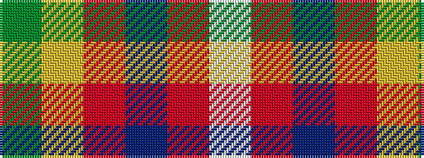

GYRBRW

It is a 6 stripe tartan.

<figure class="pat-woven">

<figcaption>idealised sample</figcaption>
</figure>

## Colour Sequence



## Tartans with this colour sequence

| Tartans |
|---------------|
| [Pool, Robert David (Personal)](/setts/s6/w2o2t25r3lo3dg1~x4/)|
||
