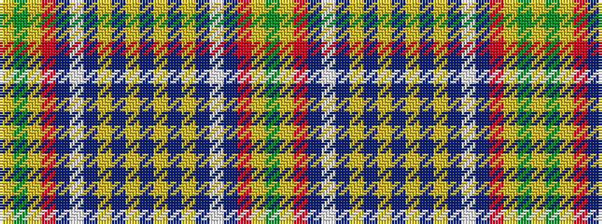

GYRBWBYBYBYBYBWBRYGY

It is a 20 stripe tartan.

<figure class="pat-woven">

<figcaption>idealised sample</figcaption>
</figure>

## Colour Sequence



## Tartans with this colour sequence

| Tartans |
|---------------|
| [Hutt #1 (Personal)](/setts/s20/dg7ly2r1n4lb15n1ly2n1ly2n2ly2n1ly2n1lb15n4r1ly2dg7ly1~x4/)|
||
