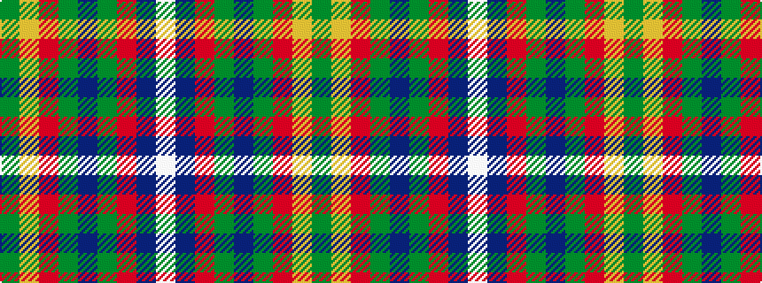

GYRGBGRBW

It is a 9 stripe tartan.

<figure class="pat-woven">

<figcaption>idealised sample</figcaption>
</figure>

## Colour Sequence



## Tartans with this colour sequence

| Tartans |
|---------------|
| [Patel (2013)](/variants/s9/dg3lo2m10dg10b20dg12r3b10w2~x2/)|
||
| [Patel Name Tartan](/variants/s9/dg3lo2o10dg10db20dg12r3db10w2~x2/)|
||
