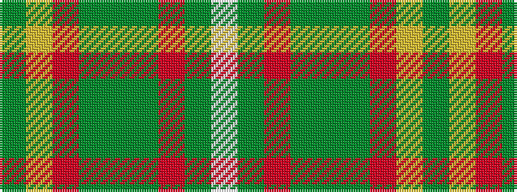

GYRGGGRGW

It is a 9 stripe tartan.

<figure class="pat-woven">

<figcaption>idealised sample</figcaption>
</figure>

## Colour Sequence



## Tartans with this colour sequence

| Tartans |
|---------------|
| [Patel (2013)](/setts/s9/dg3ly2ri10dg10g20dg12r3g10w2~x2/)|
||
