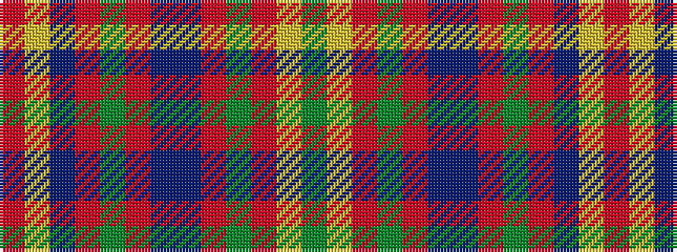

GYRGRBBRGRBYR

It is a 13 stripe tartan.

<figure class="pat-woven">

<figcaption>idealised sample</figcaption>
</figure>

## Colour Sequence



## Tartans with this colour sequence

| Tartans |
|---------------|
| [MacDonald of Glencoe #2](/variants/s13/r5ly1db2r2dg30r5db10t1r42dg2r4ly1dg4~x2/)|
||
| [MacDonald, of Glencoe](/variants/s13/r5ly1db2r2g30r5db10t1r42g2r4ly1g4~x2/)|
||
