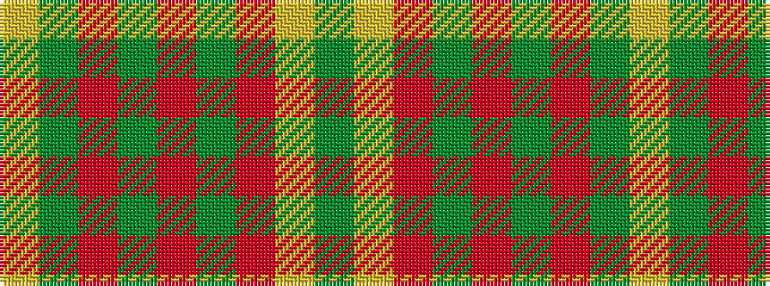

GYRGRGRGY

It is a 9 stripe tartan.

<figure class="pat-woven">

<figcaption>idealised sample</figcaption>
</figure>

## Colour Sequence



## Tartans with this colour sequence

| Tartans |
|---------------|
| [Dalwhinnie Trade Tartan](/variants/s9/dg70ly6o28g56o5g11o5g11lo12/)|
||
