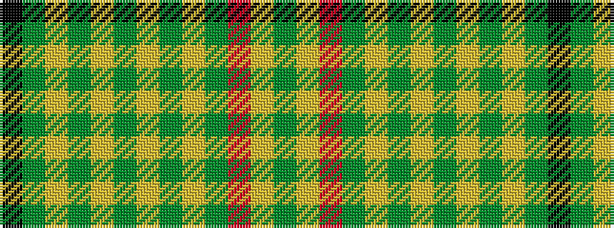

GYRGYGYGYGYGK

It is a 13 stripe tartan.

<figure class="pat-woven">

<figcaption>idealised sample</figcaption>
</figure>

## Colour Sequence



## Tartans with this colour sequence

| Tartans |
|---------------|
| [Glen Affric, Fragment](/setts/s13/k2g2lr10g2lr7g2lr7g2lr5g2r14lr1g2~x2/)|
||
| [Glenaffric Fragment](/setts/s13/k2dg2lr10dg2lr7dg2lr7dg2lr5dg2r14lr1dg2~x2/)|
||
