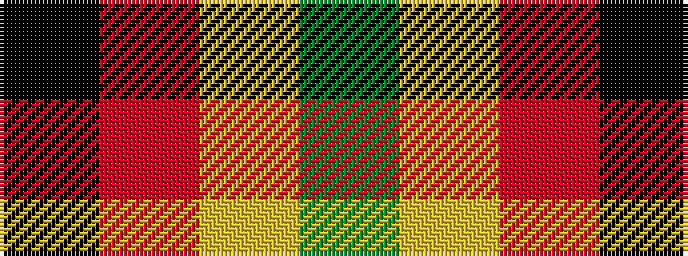

GYRK

It is a 4 stripe tartan.

<figure class="pat-woven">

<figcaption>idealised sample</figcaption>
</figure>

## Colour Sequence



## Tartans with this colour sequence

| Tartans |
|---------------|
| [Meaux, Luc G (Personal)](/variants/s4/k62o24lo5dg3~x2/)|
||
