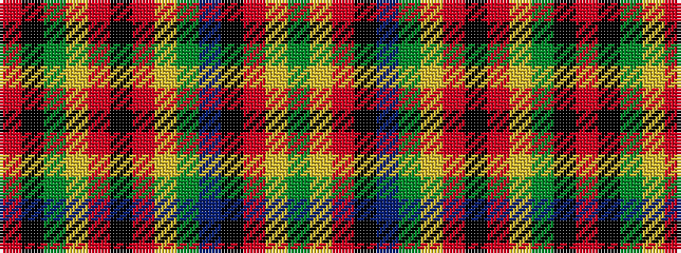

GYRKBGYRKRYGKR

It is a 14 stripe tartan.

<figure class="pat-woven">

<figcaption>idealised sample</figcaption>
</figure>

## Colour Sequence



## Tartans with this colour sequence

| Tartans |
|---------------|
| [MacFarlane](/setts/s14/r42k1dg12lr2r3k1r3lr2dg2n12k4r3lr4dg3~x2/)|
||
| [MacFarlane](/setts/s14/r42k1dg12lr2r3k1r3lr2dg2n12k4r3lr4dg3/)|
||
