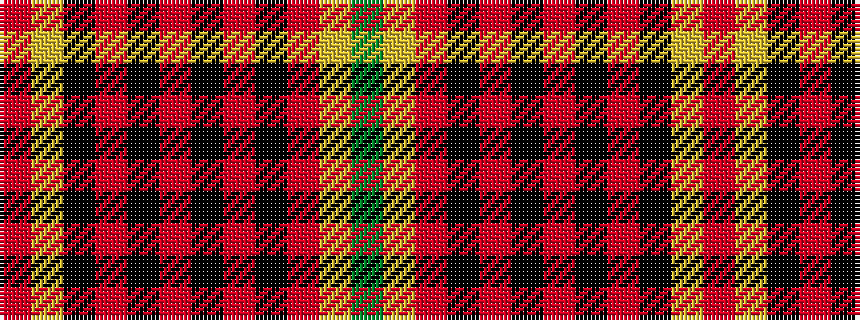

GYRKRKRKRKYR

It is a 12 stripe tartan.

<figure class="pat-woven">

<figcaption>idealised sample</figcaption>
</figure>

## Colour Sequence



## Tartans with this colour sequence

| Tartans |
|---------------|
| [Hallingdal (District)](/setts/s12/r2ly1k2r13k2r2k2r2k12r2ly1g2~x2/)|
||
